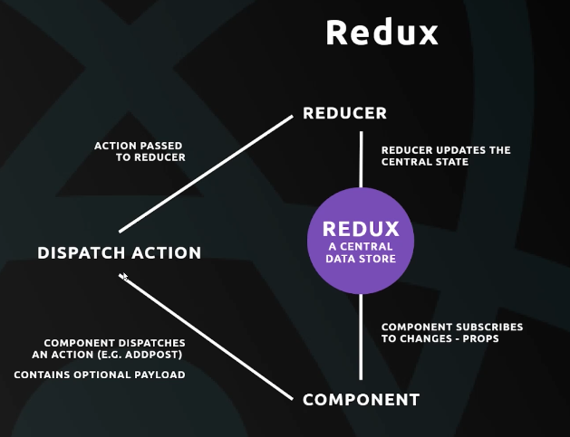

## Soccer Player CRUD - React / Redux

This is a **Create Read Update Delete** Application created from scratch.

### Experience this Application!  [Live Link ](https://floating-bastion-67582.herokuapp.com)

Functionalities include :

1. Adding Players Manually To A Dream Team.
2. Updating State From Any Component Using Redux Store.
3. Deleting Single Or All Players From the Squad.
4. Edit Player's Details (using Redux).
5. Front End Validation While Adding Players.

To Run The Application

`git clone https://github.com/RohitoOo/React_Redux_Soccer_Team_App` - Clone The Repo   
 `npm install` - Install Dependencies  
 `npm start` - Run Application

*Make Sure You Have nodeJs Installed Locally*

Personal Portfolio
-------------------

[Rohit Bhambhani](http://rohito.com)
